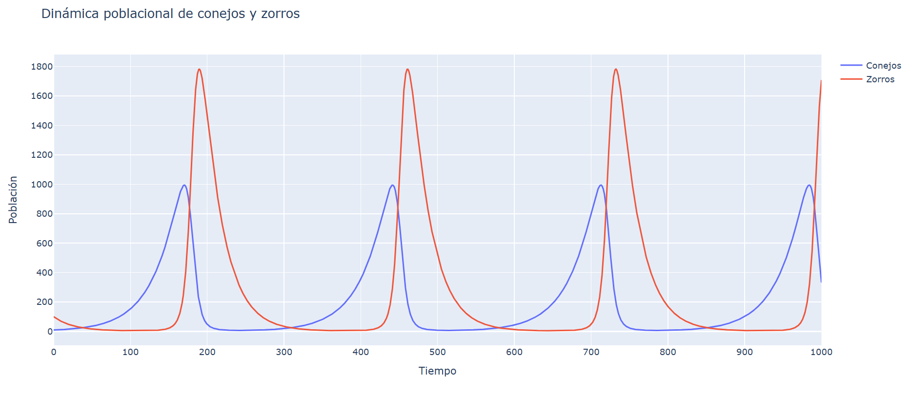

### Modelos Ecológicos (Depredador-Presa)

Los modelos ecológicos, específicamente los modelos depredador-presa, describen las interacciones entre dos poblaciones biológicas que coexisten en un ambiente. Un ejemplo clásico es el del zorro y el conejo: los zorros (depredadores) se alimentan de los conejos (presas), mientras que los conejos se nutren de la vegetación disponible en el bosque.

El modelo clásico fue desarrollado por el matemático italiano Vito Volterra en la década de 1920, inspirado por las variaciones cíclicas observadas en las poblaciones de tiburones y peces en el Mar Adriático.

Para construir el modelo depredador-presa, se representa el número de presas en el tiempo $t$ por $x(t)$, el número de depredadores por $y(t)$ y se consideran tres suposiciones principales:

-**Crecimiento natural de las presas**: 
en ausencia de depredadores, la población de presas crece a una tasa natural $\frac{dx}{dt} = ay$, donde $a > 0$.

-**Declinación de los depredadores sin presas**: 
En ausencia de presas, la población de depredadores disminuye a una tasa natural $\frac{dy}{dt} = -by$, donde $b > 0$.

-**Interacción depredador-presa**: 
La declinación de la población de presas y el crecimiento de la población de depredadores ocurre a una tasa proporcional a la frecuencia de encuentros entre las dos especies, representada por $-pxy$ para la población de presas y $qxy$ para la población de depredadores.

La dinámica de las poblaciones de presas ($x$) y depredadores ($y$) se modela con las siguientes ecuaciones diferenciales:

$$
\frac{dx}{dt} = ax - pxy = x(a - py)
$$
$$
\frac{dy}{dt} = -by + qxy = y(-b + xq)
$$

donde, $a$, $b$, $p$, y $q$ son constantes positivas. Es importante notar que la ecuación de los depredadores tiene términos lineales negativos y términos de interacción positivos, mientras que la ecuación de las presas tiene términos lineales positivos y términos de interacción negativos.

### Puntos críticos y Estabilidad

Los puntos críticos del sistema depredador-presa son soluciones de las ecuaciones $x(a - py) = 0$ y $y(-b + qx) = 0$.  Se identifican dos puntos críticos aislados: $(0,0)$ y $(\frac{b}{q}, \frac{a}{p})$.

-**El punto crítico (0,0):**
En el punto crítico $(0,0)$ la matriz jacobiana del sistema es 
$
\begin{pmatrix}
a & 0 \\
0 & -b
\end{pmatrix}
$
. Los eigenvalores de esta matriz son $\lambda_1 = a > 0$ y $\lambda_2 = -b < 0$ , y  indicando que $(0,0)$ es un punto de silla inestable. La solución de equilibrio correspondiente describe la extinción simultánea de las poblaciones de presa y depredador.

### Breve profundización en los temas mencionados anteriormente:

La matriz jacobiana es una herramienta matemática utilizada para analizar la estabilidad de puntos críticos en sistemas de ecuaciones diferenciales no lineales. Representa la derivada parcial de cada función con respecto a cada variable del sistema. En términos sencillos, nos ayuda a entender cómo pequeñas perturbaciones alrededor de un punto crítico afectan el comportamiento del sistema.
Para hallar la matriz jacobiana de un sistema de ecuaciones diferenciales, se siguen estos pasos:

**1**-Derivar las ecuaciones del sistema: Esto implica tomar la derivada parcial de cada ecuación con respecto a cada variable.

**2**-Construir la matriz: La matriz resultante, llamada jacobiana, tiene en sus filas y columnas estas derivadas parciales.

Para el sistema depredador-presa, las ecuaciones son:

$$
\frac{dx}{dt} = x(a - py)
$$
$$
\frac{dy}{dt} = y(-b + qx)
$$

Las derivadas parciales se calculan de la siguiente manera:

$$
\frac{\partial}{\partial x}{x(a - py)} = a - px
$$

$$
\frac{\partial}{\partial y}{x(a - py)} = -px
$$

$$
\frac{\partial}{\partial x}{y(-b + qx)} = qy
$$

$$
\frac{\partial}{\partial y}{y(-b + qx)} = -b + qx
$$

Por lo tanto, la matriz jacobiana es:

$$
\begin{pmatrix}
a - py & -px \\
qy & -b + qx
\end{pmatrix}
$$

Un punto crítico del sistema es un punto $(x_*, y_*)$ tal que, dado un sistema autónomo:

$$
\frac{dx}{dt} = F(x,y)
$$
$$
\frac{dy}{dt} = G(x,y)
$$

Se cumple que:

$$
F(x_*, y_*) = G(x_*, y_*) = 0
$$
Si  es un punto crítico entonces las funciones constantes :

$$
x(t) \equiv x_*
$$
$$
y(t) \equiv y_*
$$

tienen derivadas $x'(t) \equiv 0 $ , $ y'(t) \equiv 0$ y , por lo que satisfacen automáticamente las ecuaciones del sistema. Una solución constante de este tipo se llama solución de equilibrio del sistema.
En la práctica, en un problema de modelación de dos especies A y B, un punto crítico del sistema $(x_*, y_*)$ especifica una población constante  de la especie A y una poblacion constante $y_*$ de la especie B que pueden coexistir una con otra en el medio ambiente. 

Si $(x_0, y_0)$ no es un punto  crítico del sistema, entonces no es posible para esa población constante de la especie A y la especie B que puedan coexistir y, una o ambas deben cambiar con el tiempo.

Si $(x_*, y_*)$ es un punto crítico, entonces la solucion de equilibrio $x(t) \equiv x_* $ , $ y(t) \equiv y_*$,  se llama estable o inestable dependiendo de la naturaleza del punto crítico.

En aplicaciones, la estabilidad de una solución de equilibrio es de fundamental importancia. La consecuencia  práctica de estabilidad es que cambios ligeros (como nacimientos y muertes aleatorias) en las poblaciones de equilibrio no alterararán el equilibrio, como resultaría en grandes desviaciones de las soluciones de equilibrio.

El puntos crítico $(\frac{b}{q}, \frac{a}{p})$:

En el punto crítico $(\frac{b}{q}, \frac{a}{p})$, la matriz jacobiana del sistema es $
\begin{pmatrix}
0 & -\frac{pb}{q} \\
\frac{aq}{p} & 0
\end{pmatrix}
$. Los eigenvalores son imaginarios puros, indicando un centro estable en la linealización. Sin embargo, se requiere una investigación adicional para determinar la naturaleza exacta del punto crítico en el sistema no lineal.

### El Plano de Fase y Soluciones Periódicas
El plano de fase es una representación gráfica que muestra las trayectorias de un sistema de ecuaciones diferenciales en el espacio de fase, donde cada punto representa un estado del sistema. En el contexto del modelo depredador-presa, el plano de fase nos ayuda a visualizar cómo evolucionan las poblaciones de presas y depredadores a lo largo del tiempo.

Un ejemplo clásico de análisis de plano de fase para un sistema depredador-presa típico verifica la concordancia cualitativa entre la linealización en los puntos críticos y el plano de fase. El primer cuadrante del plano es relevante porque corresponde a soluciones físicamente significativas que describen poblaciones no negativas.

### Competencia entre Especies
Cuando se considera la competencia entre dos especies (como plantas, animales o bacterias) con poblaciones $x(t)$ y $y(t)$ , que compiten por el alimento disponible en su ambiente común, se obtiene un caso diferente al de una especie que depreda a la otra. En ausencia de una de las especies, la otra debería tener una población limitada (logística).
En ausencia de cualquier interacción entre las dos especies, sus poblaciones satisfacen las siguientes ecuaciones diferenciales:

$$
\frac{dx}{dt} = a_1x - b_1x^2
$$
$$
\frac{dy}{dt} = a_2y - b_2y^2
$$

Sin embargo, la competencia provoca una tasa de decrecimiento en cada población proporcional al producto $xy$. Al incorporar estos términos con constantes de proporcionalidad negativas en las ecuaciones, se obtiene el sistema de competencia:

$$
\frac{dx}{dt} = a_1x - b_1x^2 - c_1xy
$$
$$
\frac{dy}{dt} = a_2y - b_2y^2 - c_2xy
$$

donde los coeficientes $ a_1, a_2, b_1, b_2, c_1, c_2$  son todos positivos.
El sistema casi lineal resultante tiene cuatro puntos críticos, obtenidos al igualar a cero los lados derechos de las ecuaciones. Estos puntos son: $(0,0), (0, \frac{a_2}{b_2}), (\frac{a_1}{b_1}, 0)$ un cuarto punto crítico derivado de la solución simultánea de las ecuaciones:

$$
b_1 x + c_1 = a_1
$$
$$
b_2 x + c_2 = a_2
$$

**Estabilidad del Punto Crítico** $(x_E, y_E)$:
En la mayoría de las aplicaciones más interesantes, estas ecuaciones tienen solo una solución y el punto crítico correspondiente se encuentra en el primer cuadrante del plano . Este punto $(x_E, y_E)$ es entonces el cuarto punto crítico del sistema y representa la posibilidad de coexistencia de las dos especies, con poblaciones de equilibrio constantes diferentes de cero $x(t) \equiv x_E $ , $ y(t) \equiv y_E$.
La estabilidad del punto crítico depende de si:

1) $c_1c_2 < b_1b_2$

2) $c_1c_2 > b_1b_2$

Cada desigualdad tiene una interpretación natural. Al examinar las ecuaciones, los coeficientes $b_1$ y $b_2$ representan el efecto inhibidor de cada población en su propio crecimiento (debido posiblemente a limitaciones de alimento o espacio), mientras que $c_1$ y $c_2$ representan el efecto de competencia entre las dos poblaciones.

**1**-Si $c_1c_2 < b_1b_2$, la competencia es pequeña en comparación con la inhibición, haciendo que $(x_E, y_E)$ sea un punto crítico estable asintóticamente hacia donde tienden las soluciones conforme $t \to +\infty$ . Así, las dos especies pueden coexistir en este caso.

**2**-Si $c_1c_2 > b_1b_2$, la competencia es mayor en comparación con la inhibición, haciendo que  sea un punto crítico inestable. En este escenario,$x(t)$  o $y(t)$  tiende a cero conforme $t \to +\infty$, resultando en la extinción de una de las especies.

Las interacciones de poblaciones logísticas se modelan mediante ecuaciones diferenciales que describen cómo dos poblaciones que evolucionan con el tiempo sin afectarse mutuamente. Sin embargo, dependiendo de los signos de los coeficientes de interacción  y , pueden ocurrir tres tipos de interacciones: competencia, cooperación y depredación.

1) Competencia: Si los coeficientes $c_1$ y $c_2$  son ambos positivos, la interacción entre las poblaciones se describe como competencia, donde cada una es “dañada” por la mutua interacción, disminuyendo sus tasas de crecimiento.

2) Cooperación: Si ambos coeficientes son negativos, se describe una situación de cooperación, en la que cada población es “ayudada” por la interacción mutua, incrementando sus tasas de crecimiento.

3) Depredación: Si los coeficientes tienen signos opuestos, una población actúa como depredadora y la otra como presa. Por ejemplo, si $c_1>0$ y $c_2<0$, la población $x$ es perjudicada mientras que la población $y$ se beneficia de la interacción.

Además, se evidencia el crecimiento exponencial en ausencia de interacción y la importancia del análisis del punto crítico en la comprensión de estas interacciones. Este análisis muestra que las interacciones ecológicas en la naturaleza son complejas y rara vez se ajustan a modelos simples, lo que subraya la necesidad de una investigación continua en el modelado matemático de sistemas ecológicos.

### Descripción del Problema

El modelo de depredador-presa describe la interacción entre dos especies: una especie presa (conejos) y una especie depredadora (zorros). La dinámica de estas poblaciones se puede describir mediante un sistema de ecuaciones diferenciales que tiene en cuenta las tasas de crecimiento y declive de ambas poblaciones. En este caso, las ecuaciones diferenciales son:

- La tasa de cambio de la población de conejos $C$ está dada por:
$$
  \frac{dC}{dt} = 0.03C - 0.0001CZ
$$
  Aquí, $0.03C$ representa el crecimiento natural de la población de conejos, mientras que $-0.0001CZ$ representa la disminución de la población de conejos debido a la depredación por los zorros.

- La tasa de cambio de la población de zorros $Z$ está dada por:
$$
  \frac{dZ}{dt} = -0.04Z + 0.0002CZ
  $$
  Aquí, $-0.04Z$ representa la disminución natural de la población de zorros, mientras que $0.0002CZ$ representa el aumento de la población de zorros debido a la depredación de conejos.

  ### Método de Solución

Para resolver este sistema de ecuaciones diferenciales, se utiliza el método de Runge-Kutta de cuarto orden (RK4), que es un método numérico para aproximar soluciones de ecuaciones diferenciales ordinarias. Este método es conocido por su precisión y estabilidad en la resolución de problemas de este tipo.

### Período de Oscilación

El período de oscilación es el tiempo que tarda una población en completar un ciclo completo de aumento y disminución, volviendo a su estado inicial. En el contexto de un modelo de depredador-presa, las poblaciones de presas (conejos) y depredadores (zorros) suelen oscilar debido a la interacción entre las dos especies: cuando la población de presas aumenta, la población de depredadores también aumenta debido a la mayor disponibilidad de alimento, lo que eventualmente reduce la población de presas y, a su vez, reduce la población de depredadores.

### Determinación del Período

Para determinar el período de oscilación de las poblaciones de conejos y zorros, se puede seguir el siguiente procedimiento:

1. **Identificar Picos**: Examinar los datos de la simulación para identificar los picos sucesivos en las poblaciones de conejos y zorros. Un pico es un punto donde la población alcanza un máximo local antes de comenzar a disminuir.

2. **Calcular el Período**: Medir el tiempo entre dos picos sucesivos para cada población. Este tiempo es el período de oscilación.

### Significado de los Valores

- **Período de los Conejos**: Indica cuánto tiempo tarda la población de conejos en pasar de un máximo a otro. Un período más corto sugiere que la población de conejos está cambiando rápidamente, mientras que un período más largo indica cambios más lentos.

- **Período de los Zorros**: Similar al de los conejos, pero para la población de zorros. El período de los zorros puede diferir del de los conejos debido a la fase de retraso en la respuesta de la población de depredadores a los cambios en la población de presas.

### Conclusiones Tras la Simulación

Al ejecutar la simulación del modelo de depredador-presa, se pueden extraer varias conclusiones:

1. **Oscilaciones Periódicas**:
   - Las poblaciones de conejos y zorros oscilan de manera periódica. Este comportamiento es típico de los sistemas de depredador-presa y refleja la naturaleza cíclica de las interacciones ecológicas.

2. **Estabilidad del Sistema**:
   - El sistema puede alcanzar un estado de equilibrio dinámico donde las oscilaciones se mantienen constantes en amplitud y período, lo que indica una coexistencia estable entre las dos especies.

3. **Impacto de los Parámetros**:
   - Cambios en los parámetros del modelo, como las tasas de crecimiento y depredación, pueden alterar el comportamiento del sistema, afectando la amplitud y el período de las oscilaciones. Esto puede llevar a situaciones de extinción o explosión poblacional si los parámetros no están equilibrados.

4. **Sensibilidad a Condiciones Iniciales**:
   - Las condiciones iniciales de las poblaciones pueden influir en el comportamiento a corto plazo del sistema, aunque a largo plazo, el sistema tiende a estabilizarse en un patrón oscilatorio.

5. **Importancia de la Simulación**:
   - La simulación proporciona una herramienta valiosa para entender y predecir las dinámicas poblacionales en sistemas ecológicos complejos, permitiendo explorar escenarios hipotéticos y evaluar el impacto de diferentes estrategias de manejo.